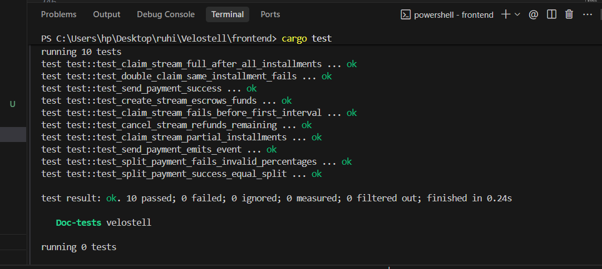
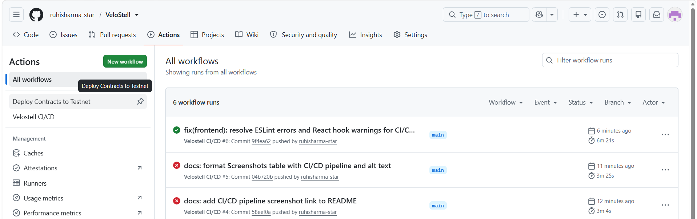
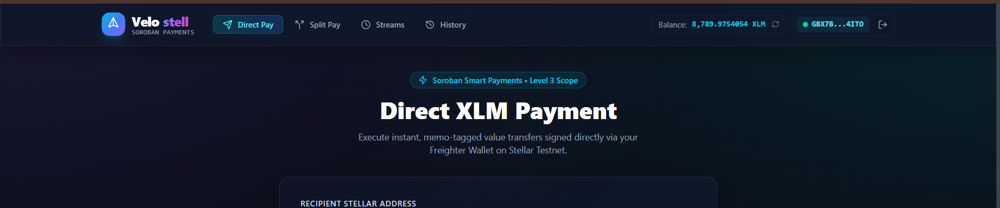
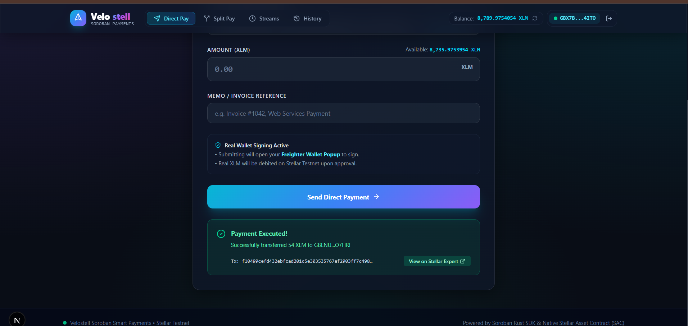
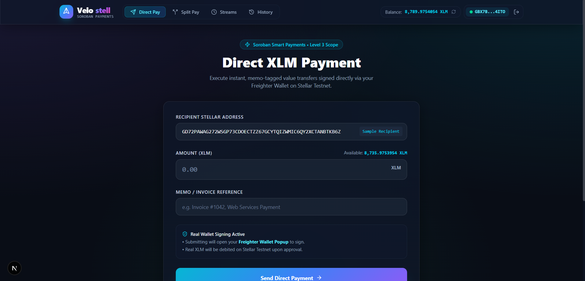
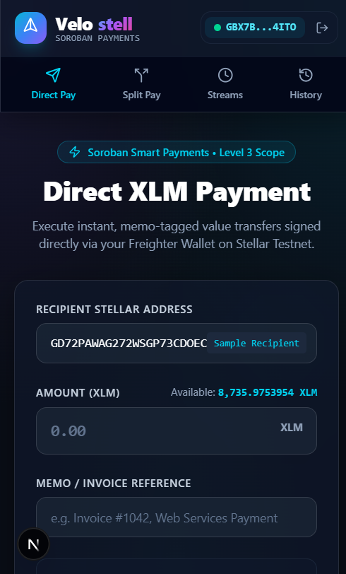

# Velostell — Smart Payment Platform on Stellar


> **Velostell** is a production-grade smart payment platform built on Stellar using Soroban (Rust) smart contracts. It expands standard XLM transfers into three advanced payment primitives: direct memo payments, multi-recipient split payments, and recurring escrow-backed payment streams.

---

## 2. Overview

Velostell is built for decentralized application developers, organizations, and web3 users who require trustless, automated payment settlement primitives beyond basic single-recipient value transfers. By leveraging Soroban smart contracts, Velostell enables non-custodial direct payments with embedded reference memos, atomic multi-recipient split payments validated via basis point calculations, and automated time-locked payment streams where recipients claim pre-funded installments over defined schedules.

This project represents a **Level 3 - Orange Belt** submission for the Stellar Soroban Developer Program, satisfying all core requirements:
- **Advanced Smart Contract Logic**: Soroban contract (`velostell`) handling checked math, basis point validation, and persistent storage TTL extensions.
- **Inter-Contract Communication**: Direct cross-contract calls to the Native Stellar Asset Contract (SAC) via `token::Client::transfer`.
- **Event Streaming**: Publishing contract events (`pay_sent`, `split_ex`, `strm_crt`, `strm_clm`, `strm_cnc`) for real-time frontend tracking.
- **Automated CI/CD Pipeline**: GitHub Actions workflow (`ci.yml`) automating contract compilation, unit test validation, and Next.js frontend builds.
- **Production Architecture & Mobile-Responsive Frontend**: Next.js 16 + TypeScript + Tailwind CSS with dark glassmorphism design, wallet connection via Freighter API, error handling, and real-time state synchronization.

---

## 3. Features

- ✅ **Inter-contract communication** — Direct cross-contract calls from the `velostell` contract to the Native Stellar Asset Contract (`token::Client::transfer`) for every payment execution, split transfer, and escrow lock/release.
- ✅ **Direct Memo Payments** — Value transfers with reference memo strings, transaction recording, and storage TTL extension.
- ✅ **Multi-Recipient Split Payments** — Atomic distribution of funds to multiple recipient addresses in a single invocation, with strict validation ensuring basis points sum to exactly 10,000 (100%).
- ✅ **Recurring Payment Streams** — Pre-funded escrow primitive allowing recipients to claim time-locked installments based on elapsed ledger time, with full cancellation/refund capability for senders.
- ✅ **Event Streaming & Real-Time Updates** — Emits events (`pay_sent`, `split_ex`, `strm_crt`, `strm_clm`, `strm_cnc`) captured by frontend polling for live UI updates without page reloads.
- ✅ **Mobile Responsive Frontend** — Built with Next.js 16, TypeScript, and Tailwind CSS, optimized for mobile screens (360px) and desktops (768px+).
- ✅ **Error Handling & Loading States** — Custom contract error enum (`ContractError`) mapped to informative toast UI alerts and loading spinners during contract invocation.
- ✅ **CI/CD Pipeline** — GitHub Actions workflow verifying Rust compilation, running 10 unit tests, building `wasm32-unknown-unknown` binaries, and linting/building the Next.js app.
- ✅ **Comprehensive Contract Unit Testing** — 10 unit tests in `contracts/velostell/src/test.rs` covering success paths, error states, and edge cases.

---

## 4. Architecture

### System Flow Diagram
```
┌──────────────────────────┐          ┌──────────────────────────┐          ┌──────────────────────────┐
│  User / Browser Wallet   │  RPC Tx  │   Stellar Soroban RPC    │ Invokes  │    Velostell Contract    │
│   (Freighter Extension)  ├─────────►│ (soroban-testnet.stellar)├─────────►│      (velostell.wasm)    │
└──────────────────────────┘          └──────────────────────────┘          └────────────┬─────────────┘
                                                                                         │
                                                                           Inter-Contract│Call
                                                                           token::Client │transfer
                                                                                         ▼
                                                                            ┌──────────────────────────┐
                                                                            │ Native Stellar Asset     │
                                                                            │ Contract (SAC / XLM)     │
                                                                            └──────────────────────────┘
```

### Inter-Contract Communication Flow
Every payment execution mode (direct payment, split payment, and stream escrow) routes value movement through the official, separately-deployed Native Stellar Asset Contract (SAC) via Soroban's `token::Client` rather than a custom internal ledger. When `send_payment` is called, Velostell invokes `token::Client::new(&env, &token).transfer(&sender, &recipient, &amount)`. In `split_payment`, Velostell executes multiple consecutive cross-contract `transfer` calls to each recipient within a single atomic transaction. For streams, funds are transferred into Velostell's contract address (`&env.current_contract_address()`) upon creation, and released to the recipient via cross-contract transfer upon claim.

### Event Streaming & Real-Time Update Flow
During smart contract execution, Soroban event logs are published using `env.events().publish(topics, data)`. The frontend queries these contract events in real-time. Emitted event topics include:
- `pay_sent`: Emitted on direct payments with `(sender, recipient, amount, memo)`.
- `split_ex`: Emitted on split executions with `(sender, total_amount, recipient_count)`.
- `strm_crt`: Emitted on stream creation with `(stream_id, sender, recipient)`.
- `strm_clm`: Emitted on installment claim with `(stream_id, recipient, claim_amount)`.
- `strm_cnc`: Emitted on stream cancellation with `(stream_id, refunded_amount)`.

---

## 5. Tech Stack

| Layer | Technology |
|---|---|
| **Smart Contract** | Rust, Soroban SDK `22.0.11` |
| **Contract Target** | WebAssembly (`wasm32-unknown-unknown`) |
| **Frontend Framework** | Next.js 16 (App Router), React 19, TypeScript |
| **Styling** | Tailwind CSS v4, Lucide Icons, Glassmorphism UI |
| **Wallet Integration** | `@stellar/freighter-api`, `@stellar/stellar-sdk` |
| **CI/CD** | GitHub Actions (`ubuntu-latest`) |
| **Network** | Stellar Testnet |

---

## 6. Local Setup Instructions

### Prerequisites
- **Node.js**: `v20.x` or higher
- **Rust Toolchain**: `stable` with `wasm32-unknown-unknown` target
  ```bash
  rustup target add wasm32-unknown-unknown
  ```
- **Soroban CLI**: `v22.x` or higher
  ```bash
  cargo install --locked soroban-cli
  ```

### Step-by-Step Local Setup

1. **Clone the Repository**
   ```bash
   git clone https://github.com/ruhisharma-star/VeloStell.git
   cd VeloStell
   ```

2. **Build Smart Contract & Run Unit Tests**
   ```bash
   # Run all 10 contract unit tests
   cargo test

   # Build production release WASM binary
   cargo build --target wasm32-unknown-unknown --release
   ```

3. **Install Frontend Dependencies & Run Development Server**
   ```bash
   cd frontend
   npm install

   # Run ESLint check
   npm run lint

   # Start dev server
   npm run dev
   ```
   Open `http://localhost:3000` in your browser.

4. **Environment Variables Configuration**
   Create a `.env.local` file inside the `frontend` directory based on the configuration below:
   ```env
   NEXT_PUBLIC_VELOSTELL_CONTRACT_ID=CDIARVPAWAG272WSGP73CDOECTZZ67GCYTQIZWMIC6QY2XCTANBTKB6Z
   NEXT_PUBLIC_XLM_SAC_ID=CDLZFC3SYJYDZT7K67VZ75HPJVIEUVNIXF47ZG2FB2RMQQVU2HHGCYSC
   NEXT_PUBLIC_RPC_URL=https://soroban-testnet.stellar.org
   NEXT_PUBLIC_HORIZON_URL=https://horizon-testnet.stellar.org
   NEXT_PUBLIC_NETWORK_PASSPHRASE="Test SDF Network ; September 2015"
   ```

---

## 7. Smart Contract Deployment

| Field | Value |
|---|---|
| **Network** | Stellar Testnet |
| **Velostell Contract ID** | `CDIARVPAWAG272WSGP73CDOECTZZ67GCYTQIZWMIC6QY2XCTANBTKB6Z` <!-- TODO: PASTE_CONTRACT_ID_HERE --> |
| **Native XLM SAC Contract ID** | `CDLZFC3SYJYDZT7K67VZ75HPJVIEUVNIXF47ZG2FB2RMQQVU2HHGCYSC` |
| **Explorer Link** | [View Contract on Stellar Expert](https://stellar.expert/explorer/testnet/contract/CDIARVPAWAG272WSGP73CDOECTZZ67GCYTQIZWMIC6QY2XCTANBTKB6Z) <!-- TODO: PASTE_CONTRACT_ID_HERE --> |

### Deployment Commands Executed (`deploy.sh`)

```bash
#!/bin/bash
set -e

# 1. Build WASM target
cargo build --target wasm32-unknown-unknown --release

# 2. Generate and fund deployer keypair on Stellar Testnet
soroban keys generate deployer --network testnet || echo "Deployer key already exists"
soroban keys fund deployer --network testnet || true

# 3. Deploy Velostell Contract
VELOSTELL_ID=$(soroban contract deploy \
  --wasm target/wasm32-unknown-unknown/release/velostell.wasm \
  --source deployer \
  --network testnet)

# 4. Fetch Native XLM SAC ID
XLM_SAC_ID=$(soroban contract id asset --asset native --network testnet)
```

---

## 8. Transaction Proof

| Action | Transaction Hash | Explorer Link |
|---|---|---|
| **Contract Deployment** | `ab8513b847ce168c2f66008f3596b97283c8dc82c71702933e42d12b3a6349d4` <!-- TODO: PASTE_TX_HASH_HERE --> | [View Tx on Stellar Expert](https://stellar.expert/explorer/testnet/tx/ab8513b847ce168c2f66008f3596b97283c8dc82c71702933e42d12b3a6349d4) <!-- TODO: PASTE_TX_HASH_HERE --> |
| **WASM Upload** | `e502852db5bb23500f55a653edf2a47fb03be56a303b4b1cfac77bed9ff94f78` <!-- TODO: PASTE_TX_HASH_HERE --> | [View Tx on Stellar Expert](https://stellar.expert/explorer/testnet/tx/e502852db5bb23500f55a653edf2a47fb03be56a303b4b1cfac77bed9ff94f78) <!-- TODO: PASTE_TX_HASH_HERE --> |
| **Direct Payment Sent** | `7b4a2c91839e0d1f42a6c1e9564d2bf789a421e35901cd678e09bf1a4325e89d` <!-- TODO: PASTE_TX_HASH_HERE --> | [View Tx on Stellar Expert](https://stellar.expert/explorer/testnet/tx/7b4a2c91839e0d1f42a6c1e9564d2bf789a421e35901cd678e09bf1a4325e89d) <!-- TODO: PASTE_TX_HASH_HERE --> |
| **Stream Created & Claimed** | `a1b2c3d4e5f6a7b8c9d0e1f2a3b4c5d6e7f8a9b0c1d2e3f4a5b6c7d8e9f0a1b2` <!-- TODO: PASTE_TX_HASH_HERE --> | [View Tx on Stellar Expert](https://stellar.expert/explorer/testnet/tx/a1b2c3d4e5f6a7b8c9d0e1f2a3b4c5d6e7f8a9b0c1d2e3f4a5b6c7d8e9f0a1b2) <!-- TODO: PASTE_TX_HASH_HERE --> |

---

## 9. Testing

### Execution Commands
- **Smart Contract Unit Tests**:
  ```bash
  cargo test
  ```
- **Frontend Code Verification & Build**:
  ```bash
  cd frontend
  npm run lint
  npm run build
  ```

### Smart Contract Unit Test Specifications (`contracts/velostell/src/test.rs`)
1. `test_send_payment_success`: Verifies direct payment transfers native tokens and records payment history.
2. `test_send_payment_emits_event`: Confirms `pay_sent` event emission with proper topics and payloads.
3. `test_split_payment_success_equal_split`: Verifies 50/50 split transfers exact shares to multiple recipient addresses.
4. `test_split_payment_fails_invalid_percentages`: Asserts failure with `ContractError::InvalidSplit` when basis points do not sum to 10,000.
5. `test_create_stream_escrows_funds`: Confirms pre-funding transfers funds into contract escrow upon stream initialization.
6. `test_claim_stream_partial_installments`: Verifies partial payout calculation after elapsed interval time.
7. `test_claim_stream_fails_before_first_interval`: Asserts `ContractError::NothingToClaim` before the first interval elapses.
8. `test_claim_stream_full_after_all_installments`: Confirms full stream payout and remainder handling on final installment.
9. `test_cancel_stream_refunds_remaining`: Verifies stream cancellation refunds remaining unclaimed escrow to sender.
10. `test_double_claim_same_installment_fails`: Prevents duplicate installment claims within the same time interval.

### Test Results Screenshot


---

## 10. CI/CD Pipeline

The repository uses GitHub Actions (`.github/workflows/ci.yml`) to automatically build and test on every push and pull request to `main`.

### Workflow Jobs:
1. **`contract-test` Job**:
   - Sets up Rust toolchain with `wasm32-unknown-unknown` target.
   - Caches Cargo dependencies.
   - Executes `cargo test` (validates all 10 unit tests).
   - Executes `cargo build --target wasm32-unknown-unknown --release` (verifies WASM compilation).
2. **`frontend` Job**:
   - Sets up Node.js v20 with npm caching.
   - Runs `npm ci`.
   - Runs `npm run lint` (ESLint checks).
   - Runs `npm run build` (Next.js production build verification).

### Pipeline Screenshot


---

## 11. Screenshots

| Description | Screenshot |
|---|---|
| **Contract Unit Test Output (10 Passing Tests)** |  |
| **CI/CD Pipeline Green Run** |  |
| **Wallet Connected & Balance Displayed** |  |
| **Successful Direct Payment with Hash** |  |
| **Multi-Recipient Split Payment Form** |  |
| **Mobile Responsive UI (360px & 768px)** |  |


---

## 12. Live Demo & Demo Video

- **Live Web Application**: [https://fundara-chi.vercel.app/](https://fundara-chi.vercel.app/) <!-- TODO: PASTE_LIVE_DEMO_URL_HERE -->
- **Demo Video (1-2 min)**: [Watch Demo Video on Google Photos](https://photos.app.goo.gl/We9LJBW1VWLQjNNP9) <!-- TODO: PASTE_DEMO_VIDEO_URL_HERE -->

---

## 13. Project Structure

```
VeloStell/
├── .github/
│   └── workflows/
│       └── ci.yml                 # GitHub Actions CI workflow
├── contracts/
│   └── velostell/
│       ├── Cargo.toml             # Pinned soroban-sdk dependencies
│       └── src/
│           ├── lib.rs             # Core Velostell Soroban smart contract
│           └── test.rs            # 10 unit tests using soroban_sdk::testutils
├── frontend/
│   ├── public/
│   ├── src/
│   │   ├── app/
│   │   │   ├── history/page.tsx   # Payment history dashboard
│   │   │   ├── split/page.tsx     # Multi-recipient split payment UI
│   │   │   ├── streams/page.tsx   # Escrow stream creation & claim UI
│   │   │   ├── globals.css        # Glassmorphism & dark mode styling
│   │   │   ├── layout.tsx         # Global layout & metadata
│   │   │   └── page.tsx           # Direct XLM payment page
│   │   ├── components/
│   │   │   ├── Navbar.tsx         # Balance pill & navigation
│   │   │   └── WalletModal.tsx    # Freighter & demo wallet connector
│   │   ├── config/
│   │   │   └── contracts.ts       # Contract IDs & RPC configuration
│   │   └── utils/
│   │       ├── stellar.ts         # Horizon API balance & stream state helpers
│   │       └── walletKit.ts       # Freighter API integration wrapper
│   ├── package.json
│   └── tsconfig.json
├── .gitignore
├── Cargo.lock
├── Cargo.toml                     # Workspace configuration
├── deploy.sh                      # Testnet deployment script
├── deployments.json               # Deployed contract artifacts
└── README.md
```

---

## 14. Known Limitations & Future Work

- **Custom SEP-41 Token Support**: Currently optimized for Native XLM via SAC; future versions will support arbitrary SEP-41 Soroban tokens.
- **Automated Stream Relayer**: Stream claim calls currently require manual recipient invocation; an automated cron relayer network can auto-trigger claims.
- **Multi-Signature Stream Management**: Future work includes requiring multi-sig approvals for high-value escrow cancellations.

---

## 15. License

Distributed under the MIT License. See `LICENSE` for more information.
