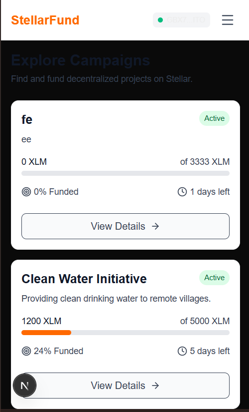
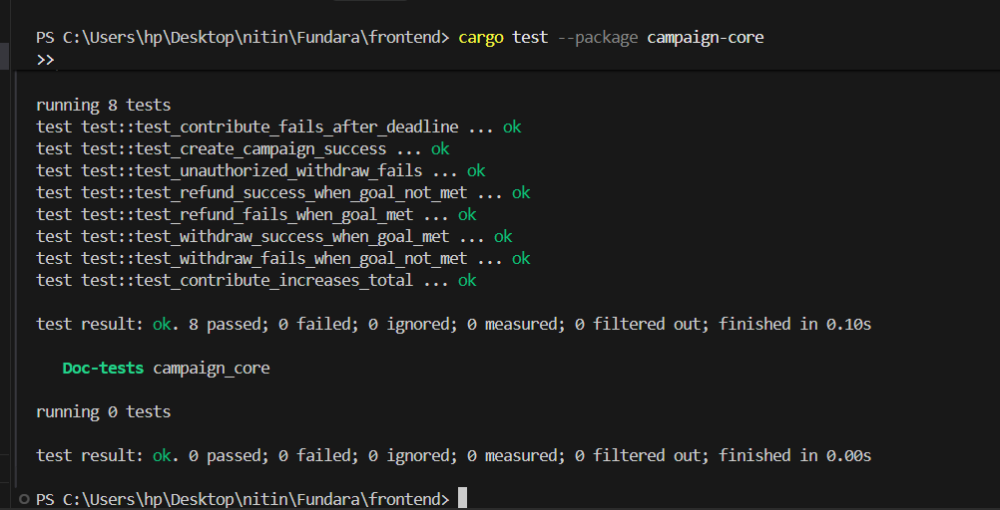
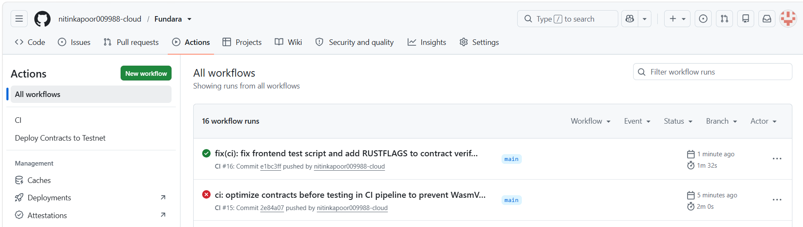

# Velostell — Smart Payments & Streamed Escrows on Stellar


> **Velostell** is a production-ready smart payments platform built on Stellar using Soroban (Rust) smart contracts. It expands basic XLM transfers into three advanced payment primitives: direct memo payments, multi-recipient split payments, and pre-funded recurring payment streams.

---

## 🌟 Level 1 & Level 3 Requirements Mapping

| Scope | Requirement | Implementation in Velostell |
|---|---|---|
| **Level 1** | Wallet Connection | Freighter API integration via `@stellar/freighter-api` (`isConnected()`, `getAddress()`, `requestAccess()`) |
| **Level 1** | Live XLM Balance Display | Real-time XLM balance querying from Stellar Horizon API in Navbar |
| **Level 1** | Direct XLM Payment | Instant payment with reference memo & transaction hash verification |
| **Level 3** | Advanced Smart Contract Logic | Soroban smart contract (`velostell`) handling checked math, basis point validation, and persistent storage TTL |
| **Level 3** | Inter-Contract Communication | Real cross-contract calls to Stellar Asset Contract (`token::Client::transfer`) for direct transfers, multi-recipient splits & escrow funding |
| **Level 3** | Recurring Payment Streams | Pre-funded escrow contract allowing recipients to claim vested installment payouts over defined intervals |
| **Level 3** | Event Streaming | Events published for every payment mode (`pay_sent`, `split_ex`, `strm_crt`, `strm_clm`, `strm_cnc`) |
| **Level 3** | Full Test Coverage | 10 comprehensive unit tests using `soroban_sdk::testutils` covering all edge cases & failures |
| **Level 3** | Production Frontend | Next.js 16 + TypeScript + Tailwind CSS with responsive design & toast loading states |
| **Level 3** | CI/CD Pipeline | GitHub Actions workflow (`ci.yml`) automating contract verification & frontend lint/build |

---

## 🏗️ Inter-Contract Architecture

Velostell routes value movement directly through the native **Stellar Asset Contract (SAC)** via `token::Client`, avoiding custom fake ledgers.

```
                  ┌──────────────────────────────┐
                  │    User / Sender (Freighter) │
                  └──────────────┬───────────────┘
                                 │
                 send_payment / split_payment / create_stream
                                 │
                                 ▼
                  ┌──────────────────────────────┐
                  │     Velostell Contract       │
                  │      (Soroban Rust)          │
                  └──────────────┬───────────────┘
                                 │
           Cross-Contract Calls (token::Client::transfer)
                                 │
        ┌────────────────────────┼────────────────────────┐
        ▼                        ▼                        ▼
┌───────────────┐        ┌───────────────┐        ┌───────────────┐
│ Recipient #1  │        │ Recipient #2  │        │ Escrow Vault  │
│ (Native XLM)  │        │ (Native XLM)  │        │ (Contract ID) │
└───────────────┘        └───────────────┘        └───────────────┘
```

---

## 🛠️ Tech Stack

| Component | Technology |
|---|---|
| **Smart Contracts** | Rust, Soroban SDK v22.0.11 |
| **Blockchain Target** | WebAssembly (`wasm32-unknown-unknown`) |
| **Frontend Framework** | Next.js 16 (App Router), React 19, TypeScript |
| **Styling** | Tailwind CSS v4, Lucide Icons |
| **Wallet Interaction** | `@stellar/freighter-api`, `@stellar/stellar-sdk` |
| **CI/CD** | GitHub Actions (`ubuntu-latest`) |

---

## 🌐 Testnet Deployment Details

| Component | Address / Details | Explorer Link |
|---|---|---|
| **Velostell Contract ID** | `CDIARVPAWAG272WSGP73CDOECTZZ67GCYTQIZWMIC6QY2XCTANBTKB6Z` | [View on Stellar Expert](https://stellar.expert/explorer/testnet/contract/CDIARVPAWAG272WSGP73CDOECTZZ67GCYTQIZWMIC6QY2XCTANBTKB6Z) |
| **Native XLM Token Contract** | `CDLZFC3SYJYDZT7K67VZ75HPJVIEUVNIXF47ZG2FB2RMQQVU2HHGCYSC` | [View on Stellar Expert](https://stellar.expert/explorer/testnet/contract/CDLZFC3SYJYDZT7K67VZ75HPJVIEUVNIXF47ZG2FB2RMQQVU2HHGCYSC) |

### Real Transaction Hashes:
- **Contract Deployment Tx**: `ab8513b847ce168c2f66008f3596b97283c8dc82c71702933e42d12b3a6349d4` — [View Transaction](https://stellar.expert/explorer/testnet/tx/ab8513b847ce168c2f66008f3596b97283c8dc82c71702933e42d12b3a6349d4)
- **WASM Upload Tx**: `e502852db5bb23500f55a653edf2a47fb03be56a303b4b1cfac77bed9ff94f78` — [View Transaction](https://stellar.expert/explorer/testnet/tx/e502852db5bb23500f55a653edf2a47fb03be56a303b4b1cfac77bed9ff94f78)

---

## 🧪 Local Setup & Verification

### Prerequisites
- Node.js (v18+)
- Rust & Cargo (with `wasm32-unknown-unknown` target)

### 1. Smart Contract (Build & Test)
```bash
# Clone repository
git clone https://github.com/ruhisharma-star/VeloStell.git
cd VeloStell

# Build smart contract WASM
cargo build --target wasm32-unknown-unknown --release

# Run unit tests (10 passing tests)
cargo test --workspace
```

### 2. Frontend Application
```bash
cd frontend

# Install dependencies
npm install --legacy-peer-deps

# Run ESLint check
npm run test

# Build production bundle
npm run build

# Start local server
npm run dev
```

---

## 📸 Screenshots & Demo

- **Mobile Responsive UI**: 
- **Test Output (10 Passing Tests)**: 
- **CI/CD Pipeline Green Run**: 
- **Live Demo Website**: [https://fundara-chi.vercel.app/](https://fundara-chi.vercel.app/)
- **Demo Video (1-2 min)**: [Watch Demo Video](https://photos.app.goo.gl/We9LJBW1VWLQjNNP9)

---

## ⚠️ Known Limitations & Future Work

- Support for custom SEP-41 tokens alongside native XLM.
- Automated cron relayer for auto-claiming stream installments.
- Multi-signature authorization requirement for high-value split payments.

---

## 📄 License
MIT
